# FOCUS//OS
## Product Blueprint, Stack Técnico, Arquitectura y Roadmap de Implementación

> **Concepto:** una plataforma personal para estudio, pasantía, foco y desarrollo profesional que reduzca la cantidad de decisiones diarias y responda rápidamente: **“¿Qué debería hacer ahora?”**

---

## 0. Resumen ejecutivo

FOCUS//OS no debería ser simplemente un calendario con tareas, sino un **Personal Operating System** que combine:

- calendario académico;
- clases y compromisos;
- sesiones de enfoque;
- control de horas de pasantía;
- tareas;
- planificación semanal;
- bloques libres;
- progreso profesional;
- recomendaciones inteligentes;
- integración con Google Calendar;
- copiloto con IA;
- MCP propio;
- analítica de hábitos;
- experiencia visual premium, oscura, industrial y minimalista.

La filosofía del producto es:

> **Menos decisiones. Más ejecución.**

La aplicación debe abrirse y decir, de forma inmediata:

1. qué viene después;
2. cuánto tiempo libre existe;
3. qué tarea tiene mayor prioridad;
4. cuánto falta de pasantía;
5. cuándo conviene estudiar;
6. si el día está sobrecargado;
7. qué acción concreta conviene ejecutar ahora.

---

# 1. Visión de producto

## 1.1 Problema

Las herramientas tradicionales tienden a separar la información:

- Google Calendar → eventos;
- Notion → notas/proyectos;
- Toggl → tiempo;
- Todoist → tareas;
- GitHub → desarrollo;
- hojas de cálculo → pasantía;
- ChatGPT → asesoría;
- calendario universitario → clases.

El costo real es mental:

```text
¿Tengo clase?
↓
¿Tengo tiempo?
↓
¿Qué tarea hago?
↓
¿Cuánto me falta de pasantía?
↓
¿Puedo estudiar antes?
↓
¿Estoy atrasado?
↓
¿Qué es más importante?
```

FOCUS//OS debe integrar estas preguntas en una sola interfaz.

---

## 1.2 Propuesta de valor

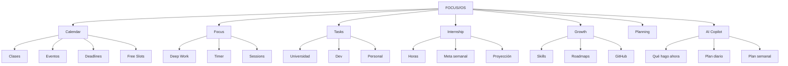

---

# 2. Principio central de UX

La pantalla inicial debe responder:

> **¿Qué tengo que hacer ahora?**

No debe empezar con 30 métricas.

La jerarquía visual debería ser:

```text
1. Próximo compromiso
2. Tiempo libre antes de ese compromiso
3. Mejor siguiente acción
4. Progreso de pasantía
5. Progreso del día
6. Timeline
7. Tareas
8. Insights
```

---

# 3. Identidad visual

## 3.1 Lenguaje de diseño

La referencia visual se puede describir como:

> **Industrial UI + Editorial SaaS + Cyber Minimalism**

Características principales:

- fondo casi negro;
- superficies oscuras ligeramente diferenciadas;
- bordes finos;
- grid visible de forma sutil;
- títulos grandes;
- labels pequeños en tipografía mono;
- contraste alto;
- naranja como acento principal;
- verde ácido para estados positivos;
- halftone;
- noise;
- líneas tipo blueprint;
- microanimaciones;
- cards sobrias;
- números grandes;
- poca saturación general.

---

## 3.2 Paleta propuesta

```css
:root {
  --background: #050505;
  --surface: #0A0A0B;
  --surface-2: #101011;
  --surface-3: #151516;

  --border: #1C1C1E;
  --border-strong: #2A2A2D;

  --text: #F2F2EF;
  --text-muted: #77777C;
  --text-subtle: #4C4C50;

  --accent: #FF6B32;
  --accent-soft: rgba(255, 107, 50, 0.12);

  --success: #8BFF32;
  --warning: #FFB02E;
  --danger: #FF4D4F;
}
```

### Regla

- **Naranja** = identidad y llamadas a la acción.
- **Verde ácido** = éxito, activo, completado, conectado.
- No usar ambos como colores dominantes al mismo tiempo.

---

# 4. Tipografía

Usar solo dos familias.

## 4.1 Sans principal

Opciones:

- Geist;
- Inter;
- Satoshi.

## 4.2 Mono

Opciones:

- Geist Mono;
- IBM Plex Mono;
- JetBrains Mono.

Ejemplo de jerarquía:

```text
TODAY / THU 13 AUG             ← mono 11px

Make the next
4 hours count.                 ← sans 48–64px

NEXT EVENT                     ← mono 10–12px
Algorithms                     ← sans 20–24px
17:30                          ← mono
```

---

# 5. Sistema de layout

Usar grid de 12 columnas.

```text
| 1 2 3 4 | 5 6 7 8 | 9 10 11 12 |
```

Ejemplo desktop:

```text
NEXT EVENT     4 cols
INTERNSHIP     4 cols
FOCUS          4 cols

TIMELINE       8 cols
PRIORITY       4 cols
```

Mobile:

```text
12 cols
12 cols
12 cols
```

No intentar mantener el dashboard de escritorio comprimido en celular.

---

# 6. Dashboard principal

```text
┌───────────────────────────────────────────────────────────────┐
│ FOCUS//OS   TODAY CALENDAR FOCUS INTERNSHIP INSIGHTS     ⌘K  │
├───────────────────────────────────────────────────────────────┤
│                                                               │
│ ● THURSDAY / AUG 13                                          │
│                                                               │
│ Make the next                                                 │
│ 4 hours count.                                                │
│                                                               │
│ Your schedule is clear until 17:30.                           │
│                                                               │
│ [ START FOCUS → ]                                             │
│                                                               │
├─────────────────────┬─────────────────────┬───────────────────┤
│ NEXT                │ INTERNSHIP          │ FOCUS             │
│                     │                     │                   │
│ Algorithms          │ 148H / 240H         │ 2H 14M            │
│ 17:30               │ 61.8%               │ today             │
│                     │                     │                   │
├─────────────────────┴─────────────────────┬───────────────────┤
│ TODAY                                     │ PRIORITY          │
│                                           │                   │
│ 08:00 Architecture                        │ Algorithms HW     │
│ 10:00 Algorithms                          │                   │
│ 14:00 Internship                          │ 90 MIN            │
│ 17:30 Algorithms                          │                   │
│                                           │ [START]           │
└───────────────────────────────────────────┴───────────────────┘
```

---

# 7. Página TODAY

Debe ser la pantalla más útil del producto.

```text
┌─────────────────────────────────────────────────────────┐
│ TODAY                                     THU / AUG 13  │
├────────────────────────────┬────────────────────────────┤
│ NEXT EVENT                 │ TODAY PROGRESS             │
│                            │                            │
│ Algorithms                 │ Tasks        3 / 6        │
│ 17:30                      │ Focus        2h 18m       │
│                            │ Internship   3h 40m       │
├────────────────────────────┼────────────────────────────┤
│ TIMELINE                   │ BEST NEXT ACTION           │
│                            │                            │
│ 08 ─ Architecture          │ Algorithms HW             │
│ 10 ─ Algorithms            │ 90 MIN                    │
│ 12 ─ FREE                  │                            │
│ 14 ─ Internship            │ Due tomorrow              │
│ 17 ─ Algorithms            │ [ START ]                 │
└────────────────────────────┴────────────────────────────┘
```

---

# 8. Navegación

Mantener la navegación compacta.

```text
FOCUS//OS

TODAY
CALENDAR
FOCUS
INTERNSHIP
TASKS
INSIGHTS

                              ⌘ K     ● USER
```

La IA no necesita ser inicialmente una página completa.

Debe abrirse como panel lateral.

---

# 9. Copiloto lateral

```text
                              ┌──────────────────────────┐
                              │ COPILOT              ×  │
                              │                          │
                              │ You have 2h 20m free     │
                              │ before your next class.  │
                              │                          │
                              │ Best use of this block:  │
                              │                          │
                              │ Algorithms — 90m         │
                              │ Project — 50m            │
                              │                          │
                              │ [CREATE FOCUS BLOCKS]    │
                              └──────────────────────────┘
```

---

# 10. Stack recomendado

## 10.1 Resumen

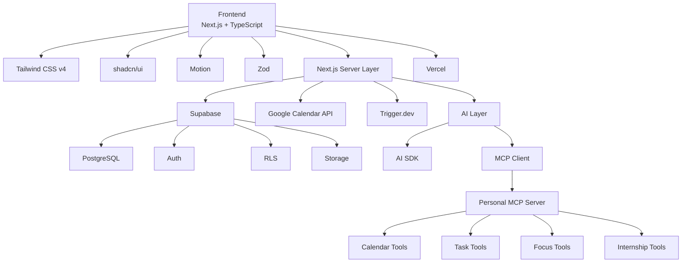

---

## 10.2 Frontend

```text
Next.js
TypeScript
Tailwind CSS v4
shadcn/ui
Motion
Zod
```

### Responsabilidades

- UI;
- routing;
- Server Components;
- Client Components cuando sea necesario;
- formularios;
- validación;
- render del dashboard;
- interacción.

---

# 11. Backend

Primera opción:

```text
Next.js Server Actions
+
Route Handlers
+
Services por dominio
```

No construiría microservicios inicialmente.

---

# 12. Base de datos

## Supabase

Servicios utilizados:

```text
PostgreSQL
Auth
RLS
Storage
```

Realtime solo cuando exista una razón concreta.

No utilizar Realtime para absolutamente todo.

---

# 13. Modelo de datos inicial

```text
profiles

calendar_connections
calendar_sync_state
calendar_events

courses
course_sessions

tasks

focus_sessions

internship_profiles
internship_sessions

goals

daily_plans

ai_conversations
ai_actions

integrations
```

---

# 14. Diagrama ER conceptual

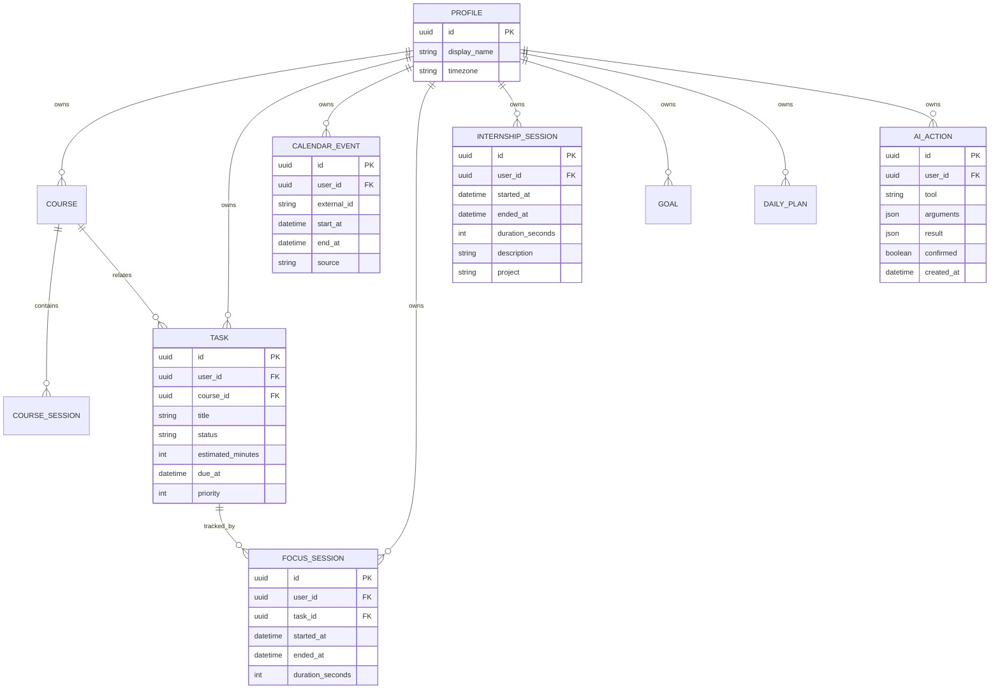

---

# 15. Módulo de pasantía

## 15.1 Objetivo

Eliminar el cálculo manual de:

- horas acumuladas;
- horas restantes;
- objetivo semanal;
- promedio semanal;
- fecha proyectada;
- retraso o adelanto.

---

## 15.2 Modelo

```text
internship_profiles
────────────────────
user_id
required_minutes
start_date
deadline
weekly_target
company
role
```

```text
internship_sessions
────────────────────
id
user_id
started_at
ended_at
duration_seconds
description
project
created_at
```

---

## 15.3 UI

```text
INTERNSHIP
━━━━━━━━━━━━━━━━━━━━━━━━━━━━━━━━━━━━━━━━━━

148H 32M
of 240 required hours

████████████████████████░░░░░░░░░░░

61.8% COMPLETE


THIS WEEK                         +14H 21M

MON      ████████                3h 20
TUE      ████████████            5h 10
WED      █████                   2h 14
THU      ████████                3h 37
FRI


ESTIMATED COMPLETION

SEP 27
```

---

## 15.4 Timer

```text
┌──────────────────────────────────────┐
│ ● INTERNSHIP SESSION                 │
│                                      │
│            02:18:34                  │
│                                      │
│          [ STOP SESSION ]            │
└──────────────────────────────────────┘
```

---

# 16. Regla crítica del timer

No depender de:

```js
setInterval(...)
```

como fuente de verdad.

Cuando el usuario presiona START:

```text
started_at = current timestamp
```

Cuando vuelve:

```text
elapsed = now - started_at
```

La UI solo representa ese valor.

Esto permite:

- cerrar el navegador;
- apagar el computador;
- volver;
- mantener la sesión.

---

# 17. Required Pace

Ejemplo:

```text
Required:        240 h
Completed:       148 h
Remaining:        92 h
Deadline:      Dec 10
```

La aplicación calcula:

```text
Weeks remaining       12
Required per week     7h 40m
Current average       9h 10m

STATUS
AHEAD BY 18 HOURS
```

---

# 18. Focus Mode

La pantalla de foco debe ocultar todo lo que no importa.

```text
━━━━━━━━━━━━━━━━━━━━━━━━━━━━━━━━━━━━━━━━━━━━

ALGORITHMS

Maximum Subarray
MAT-361


                    47:32


               FOCUS SESSION


       █████████████████░░░░░░░░░░


            [ PAUSE ]    [ END ]


────────────────────────────────────────────

NEXT
Architecture of Software · 19:30

━━━━━━━━━━━━━━━━━━━━━━━━━━━━━━━━━━━━━━━━━━━━
```

---

# 19. Gamificación

Evitar:

```text
🔥 34 DAY STREAK
+500 XP
LEVEL 37
```

Preferir una gamificación sobria:

```text
CONSISTENCY

M T W T F S S
● ● ● ● ○ ○ ○

4 / 7
```

o:

```text
DEEP WORK

12H 43M

↑ 18% vs last week
```

---

# 20. Calendar

No copiar Google Calendar.

Crear un calendario orientado a estudiantes.

```text
WEEK 33

       MON       TUE       WED       THU       FRI

08     ████      ████                ████
       ARCH      ARCH                ARCH

10               ████      ████
                 ALGO      ALGO

12                         · FREE ·

14     ███████   ███████   ███████   ███████
       INTERNSHIP

16

18     ████                ████
       STUDY               PROJECT
```

Tipos de bloques:

```text
● CLASS
● INTERNSHIP
● FOCUS
● DEADLINE
● PERSONAL
```

---

# 21. Google Calendar

## 21.1 Integración principal

Usar:

```text
Google Calendar API
+
OAuth 2.0
```

No utilizar MCP como sustituto de la integración principal.

---

## 21.2 Flujo

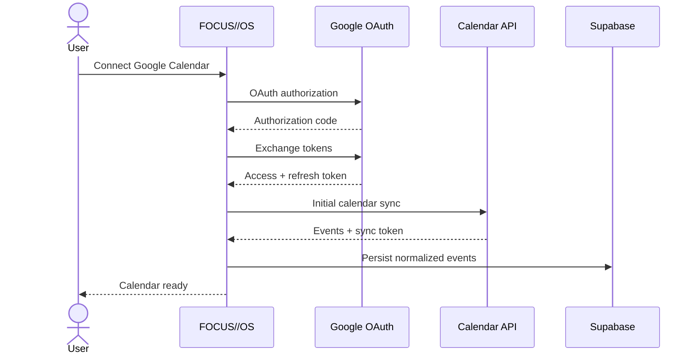

---

# 22. Sincronización incremental

No hacer polling continuo.

Arquitectura:

```text
FIRST LOGIN

Google
   │
   ▼
Full calendar sync
   │
   ▼
save nextSyncToken


LATER

Calendar changed
       │
       ▼
Google webhook
       │
       ▼
/api/calendar/webhook
       │
       ▼
incremental sync
       │
       ▼
update DB
```

---

# 23. OAuth

Principio:

> solicitar el menor número de permisos posible.

Primera versión:

```text
Calendar Read
```

Más adelante, si el usuario quiere crear bloques:

```text
Calendar Write
```

No pedir acceso a Gmail, Drive, Contacts y demás en el primer login.

---

# 24. Free Slots

Analizar el calendario para encontrar ventanas libres.

Ejemplo:

```text
FREE TODAY

12:00 → 13:30       1h 30m
16:00 → 17:30       1h 30m
20:30 → 22:00       1h 30m
```

Cruzar esas ventanas con tareas:

```text
AVAILABLE TASKS

Algorithms HW          90m
Read chapter            45m
Fix API issue           60m
```

Sugerencia:

```text
16:00 → 17:30
Algorithms HW
```

---

# 25. Planning Engine

Debe existir ANTES que la IA.

Funciones determinísticas:

```text
findFreeSlots()
calculateInternshipPace()
calculateTimeBudget()
rankTasks()
calculateWeeklyLoad()
estimateCompletionDate()
buildDailyPlan()
buildWeeklyPlan()
```

La IA consume estas funciones.

La IA no debe reemplazar la lógica de negocio.

---

# 26. Best Next Action

Ejemplo:

```text
NEXT BEST ACTION

Algorithms assignment

WHY

Due tomorrow
90 min estimated
You have 112 min free
High priority

[ START 90 MIN SESSION ]
```

---

# 27. Time Budget

```text
168 HOURS
━━━━━━━━━━━━━━━━━━━━━━━━━━

Sleep        56h
University   22h
Internship   15h
Study        18h
Projects      8h
Free         49h
```

Comparación:

```text
PLANNED                  ACTUAL

Study
18h                      11h 24m

Internship
15h                      16h 32m
```

---

# 28. Load Score

```text
WEEK LOAD

MON ███████░░
TUE █████████
WED █████░░░░
THU ████████░
FRI ███░░░░░░
```

Ejemplo de detalle:

```text
THURSDAY

Classes       4h
Internship    4h
Study         3h

TOTAL
11h

HEAVY DAY
```

---

# 29. Estimación realista de tareas

Cada tarea:

```text
Implement OAuth

Estimated      2h
Actual         3h 18m
```

Tras varias semanas:

```text
YOUR ESTIMATION ACCURACY

0.72x
```

La plataforma puede aprender que una estimación de 60 minutos suele convertirse, por ejemplo, en 85 minutos.

Esto mejora la planificación futura.

---

# 30. Command Palette

Atajo:

```text
CTRL + K
```

Interfaz:

```text
COMMAND
─────────────────────────

> start

Start focus session
Start internship
Create task
Create event
Open today
Ask AI
```

---

# 31. Universal Quick Add

Atajo conceptual:

```text
Q
```

Ejemplo:

```text
> terminar arquitectura mañana 18:00 90m
```

Parser:

```yaml
task:
  title: terminar arquitectura
  due: tomorrow 18:00
  estimate: 90
```

Otros:

```text
> pasantía 14:00-17:00
> focus algoritmos 90m
```

---

# 32. Growth / Roadmap

```text
DEVELOPMENT
━━━━━━━━━━━━━━━━━━━━━━━━━━━━━━━━━━━━

Backend Engineering

C# fundamentals           ███████████████  DONE
OOP                       ███████████████  DONE
SOLID                     ██████████░░░░░  72%
Design Patterns           █████░░░░░░░░░░  38%
ASP.NET Core              ███░░░░░░░░░░░░  21%
Databases                 ███████░░░░░░░░  51%
Architecture              ██░░░░░░░░░░░░░  13%
```

---

# 33. GitHub — V2

El módulo puede mostrar:

```text
DEV ACTIVITY

7 commits
2 PRs
3h 42m coding focus

CURRENT PROJECT

Personal OS
━━━━━━━━━━━━━━━━━━━━ 47%
```

No convertir commits en productividad.

La pregunta principal debe seguir siendo:

> **¿Qué terminé?**

---

# 34. Weekly Review

```text
WEEK 33
━━━━━━━━━━━━━━━━━━━━━━━━━━━━━━━━

FOCUS
12h 43m
↑ 2h 20m

INTERNSHIP
16h 12m
Target: 15h

TASKS
18 / 22

TOP AREA
Algorithms
5h 42m

MISSED
3 tasks

NEXT WEEK
Heavy university workload
```

Review generado:

```text
AI REVIEW

You consistently underestimated
programming tasks by ~35%.

Tuesday and Thursday had your
highest focus completion.

Recommendation:
move deep work before 18:00.
```

---

# 35. Morning Brief

```text
THURSDAY

3 classes
1 deadline
4h internship planned

AVAILABLE FOCUS
2h 40m

⚠ Algorithms assignment
due tomorrow.

Suggested:
start before 17:30.
```

---

# 36. MCP

## 36.1 Uso correcto

MCP debe servir como capa de herramientas para la IA.

No como sustituto de la integración normal de Google Calendar.

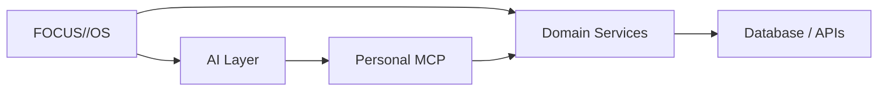

---

# 37. MCP propio

Proyecto:

```text
personal-os-mcp/
```

Herramientas iniciales:

## Calendar

```text
get_today_schedule()
get_week_schedule()
get_free_slots()
create_focus_block()
move_event()
```

## Internship

```text
start_internship_session()
stop_internship_session()
get_internship_progress()
get_required_weekly_hours()
get_projected_completion_date()
```

## Focus

```text
start_focus_session()
stop_focus_session()
get_focus_stats()
```

## Tasks

```text
create_task()
complete_task()
reschedule_task()
get_priority_tasks()
```

## Planning

```text
build_daily_plan()
build_weekly_plan()
get_available_time()
```

---

# 38. MCP Resources

Recursos estructurados:

```text
calendar://today
calendar://week
internship://progress
focus://today
tasks://pending
goals://semester
```

---

# 39. Flujo del copiloto

Usuario:

```text
Tengo que estudiar algoritmos,
avanzar mi proyecto y hacer
15 horas de pasantía esta semana.
Organízame.
```

IA:

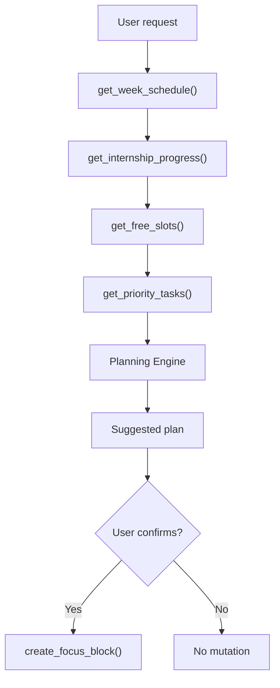

---

# 40. Regla de seguridad para IA

Lectura:

```text
✓ calendar
✓ tasks
✓ progress
✓ statistics
```

Mutaciones:

```text
→ delete
→ reschedule
→ create events
→ modify internship hours
```

requieren confirmación explícita.

Ejemplo:

```text
AI ACTION

Create 3 calendar blocks?

+ Algorithms       2h
+ Internship       3h
+ Project          1h 30m

[CANCEL]             [CONFIRM]
```

---

# 41. AI Action Log

Tabla:

```text
ai_actions

id
user_id
tool
arguments
result
confirmed
created_at
```

UI:

```text
AI ACTIVITY

19:43
Created focus block
Algorithms — 90m

19:41
Read weekly schedule

19:40
Calculated free time
```

---

# 42. Arquitectura de IA

No:

```text
USER
 ↓
LLM
 ↓
DATABASE
```

Sí:

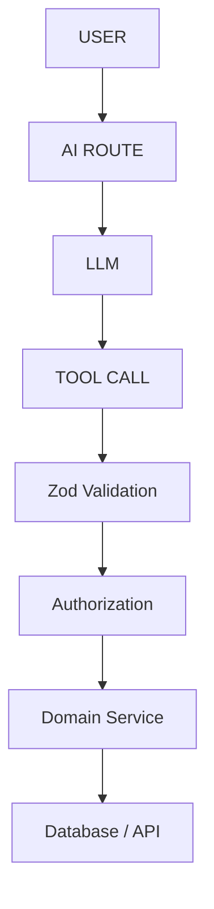

El modelo nunca debe tocar SQL directamente.

---

# 43. AI SDK

Utilidad:

```text
streaming
tool calling
structured outputs
provider abstraction
MCP integration
```

El objetivo es evitar atar toda la arquitectura a un solo proveedor.

---

# 44. Trigger.dev

Usarlo para trabajos en background:

```text
renewGoogleWebhook()
syncCalendar()
generateWeeklyReview()
sendDeadlineReminder()
generateDailyPlan()
```

No para acciones simples que pueden resolverse de inmediato.

---

# 45. n8n

## Uso recomendado

n8n puede ser muy útil para prototipar:

```text
Google Calendar
Gmail
GitHub
Automations
MCP Server Trigger
```

Arquitectura temporal:

```text
                  n8n
                   │
       ┌───────────┼────────────┐
       ▼           ▼            ▼
 Google Calendar  Gmail       GitHub
       │
       └───────────┬────────────┘
                   │
               MCP Server
                   │
                   ▼
                  AI
```

### MVP

Muy útil.

### Producción

Mover la lógica de negocio principal al backend.

---

# 46. Qué NO meter en n8n

No utilizar n8n para:

- timer de pasantía;
- cálculo de horas;
- sesiones de foco;
- lógica core de tareas;
- permisos;
- reglas de negocio.

Eso debe vivir en el backend.

---

# 47. Arquitectura final recomendada

```text
┌─────────────────────────────────────────┐
│                 CLIENT                  │
│                                         │
│ Next.js + Tailwind + shadcn + Motion    │
└────────────────────┬────────────────────┘
                     │
                     ▼
┌─────────────────────────────────────────┐
│              NEXT.JS SERVER             │
│                                         │
│ Services                                │
│ Calendar │ Tasks │ Focus │ Internship   │
│ Planning │ AI                           │
└─────────────┬─────────┬─────────┬───────┘
              │         │         │
        ┌─────▼───┐ ┌──▼──────┐ ┌▼──────────────┐
        │Supabase │ │Google    │ │ Trigger.dev   │
        │Postgres │ │Calendar  │ │ Background    │
        └─────────┘ └──────────┘ └───────────────┘

                      │
                      ▼

               ┌──────────────┐
               │   AI LAYER   │
               │              │
               │ AI SDK       │
               │ MCP Client   │
               └──────┬───────┘
                      │
                      ▼
               ┌──────────────┐
               │ Personal MCP │
               │              │
               │ calendar     │
               │ tasks        │
               │ focus        │
               │ internship   │
               └──────────────┘
```

---

# 48. Arquitectura de carpetas

```text
src/
│
├── app/
│
├── modules/
│   │
│   ├── calendar/
│   │   ├── components/
│   │   ├── actions/
│   │   ├── queries/
│   │   ├── services/
│   │   └── schemas/
│   │
│   ├── internship/
│   ├── focus/
│   ├── tasks/
│   ├── planning/
│   └── ai/
│
├── components/
│   └── ui/
│
├── integrations/
│   ├── google/
│   └── mcp/
│
├── lib/
│
└── styles/
```

---

# 49. Componentes de diseño

Crear componentes propios:

```text
<SystemPanel />
<Metric />
<MetricGroup />
<ProgressBar />
<StatusDot />
<Tag />
<Timeline />
<CommandButton />
<SectionLabel />
<NoiseBackground />
<DotGrid />
<Glow />
<AIAction />
<EmptyState />
```

Toda la aplicación debe construirse sobre ellos.

---

# 50. Texturas y fondos

Evitar imágenes pesadas.

Usar CSS:

```css
background:
  radial-gradient(...),
  linear-gradient(...);
```

Combinado con:

- masks;
- pseudo-elements;
- opacity;
- repeating-radial-gradient;
- noise muy sutil;
- grid lines.

Esto permite:

```text
halftone
dots
grid
fade
glow
noise
```

sin cargar PNGs grandes.

---

# 51. Motion

Usar animaciones mínimas.

## Hover

```text
border → brighter
background → +2% luminance
icon → translateX(2px)
```

## Page entry

```text
opacity: 0 → 1
translateY: 5px → 0
duration: ~180ms
```

## Progress

Animar solo al entrar.

## Timer

Actualizar solo el componente del timer.

No rerenderizar el dashboard completo cada segundo.

---

# 52. Performance

## Objetivos

```text
LCP < 2.5s
INP < 200ms
CLS < 0.1
```

Pero la prioridad real es:

> que el dashboard autenticado se sienta instantáneo.

---

# 53. Server Components

Regla:

> Server Component por defecto.

Client Component solo para:

```text
onClick
drag
timer
dialog
animation state
interactive forms
```

Evitar convertir el dashboard entero en un único Client Component.

---

# 54. Lazy Loading

No cargar todo en el primer render.

Cargar bajo demanda:

```text
AI assistant
charts
advanced calendar
analytics
editor
```

---

# 55. Visualizaciones

Evitar instalar una librería pesada para gráficos triviales.

Para:

```text
sparkline
progress
bars
small timeline
```

usar:

```text
SVG
CSS
HTML
```

Reservar una librería de gráficos para necesidades reales.

---

# 56. Mobile

Home móvil:

```text
FOCUS//OS

THU 13 AUG

NEXT
Algorithms
17:30


[ START FOCUS ]


TODAY

● 17:30 Algorithms
● 19:30 Architecture


INTERNSHIP

148 / 240 H
[ START TIMER ]
```

Priorizar:

1. próxima clase;
2. start focus;
3. start internship;
4. tareas;
5. timeline.

---

# 57. PWA

Implementar después del core.

Beneficios:

- instalación en móvil;
- instalación en escritorio;
- launch rápido;
- sensación de app nativa;
- notificaciones futuras.

No es prioridad del Sprint 1.

---

# 58. Qué NO construir en V1

Evitar:

- chat social;
- equipos;
- amigos;
- rankings;
- gamificación infantil;
- Spotify;
- editor Markdown gigante;
- cliente de email;
- LMS propio;
- Kanban complejo;
- tracking invasivo;
- integración con 20 servicios;
- IA generando cada decisión.

Riesgo principal:

> terminar construyendo un Notion peor.

---

# 59. MVP real

El MVP debe hacer 6 cosas extremadamente bien:

```text
1. Ver mi día.
2. Ver mis clases.
3. Saber cuánto tiempo libre tengo.
4. Registrar mis horas de pasantía.
5. Iniciar una sesión de concentración.
6. Saber qué debería hacer después.
```

Si estas seis funciones son sólidas, ya existe un producto útil.

---

# 60. V1

```text
✓ Calendar sync
✓ Internship
✓ Focus
✓ Tasks
✓ Free slots
✓ Weekly planning
✓ AI assistant
✓ MCP
✓ Insights
```

---

# 61. V2

```text
GitHub
Google Tasks
Email deadlines
University LMS
PWA
Notifications
Deadline extraction
Project roadmaps
Advanced AI planning
```

---

# 62. Roadmap de implementación

## Sprint 0 — Product Spec

**Duración:** 1–2 días

Definir:

```text
core use cases
information architecture
DB model
navigation
design tokens
```

Entregables:

```text
/product
   requirements.md
   architecture.md
   database.md
   design-system.md
```

---

# 63. Sprint 1 — Visual System

**Duración:** 2–4 días

Construir:

```text
Typography
Colors
Grid
Cards
Buttons
Inputs
Modal
Progress
Tags
Navbar
Command palette
```

Además:

```text
/today
```

con datos mock.

### Objetivo

Poder decir:

> quiero abrir esta aplicación todos los días.

Todavía:

```text
0 database
0 OAuth
0 AI
```

---

# 64. Sprint 2 — Core Backend

**Duración:** 3–4 días

Supabase:

```text
Auth
profiles
tasks
focus_sessions
internship_sessions
RLS
```

Implementar:

```text
login
logout
user state
```

La página TODAY ya usa datos reales.

---

# 65. Sprint 3 — Internship Tracker

**Duración:** 2–4 días

Implementar:

```text
start
pause
stop
manual entry
history
weekly statistics
required hours
remaining hours
completion estimate
```

Resultado:

> primer módulo completo y utilizable.

---

# 66. Sprint 4 — Google Calendar

**Duración:** 4–6 días

Implementar:

```text
Google OAuth
calendar connection
full sync
incremental sync
webhook
weekly calendar
today timeline
free slot calculation
```

Resultado:

> el sistema entiende realmente la agenda del usuario.

---

# 67. Sprint 5 — Focus System

**Duración:** 3–5 días

Implementar:

```text
focus timer
focus sessions
task linking
calendar linking
focus mode
daily statistics
CTRL + K
```

---

# 68. Sprint 6 — Planning Engine

**Duración:** 3–5 días

Implementar:

```text
findFreeSlots()
calculateInternshipPace()
calculateTimeBudget()
rankTasks()
calculateWeeklyLoad()
```

La lógica debe funcionar sin IA.

---

# 69. Sprint 7 — AI Copilot + MCP

**Duración:** 5–8 días

Implementar:

```text
AI panel
AI SDK
MCP server
tools
resources
confirmation system
action audit
```

Herramientas iniciales:

```text
getToday()
getTasks()
getFreeSlots()
getInternshipProgress()
createFocusBlock()
```

No crear 50 tools inicialmente.

---

# 70. Sprint 8 — Polish

**Duración:** 3–5 días

Implementar:

```text
animations
halftone
microinteractions
responsive
keyboard navigation
skeletons
empty states
error states
optimizations
performance audit
```

---

# 71. Roadmap visual

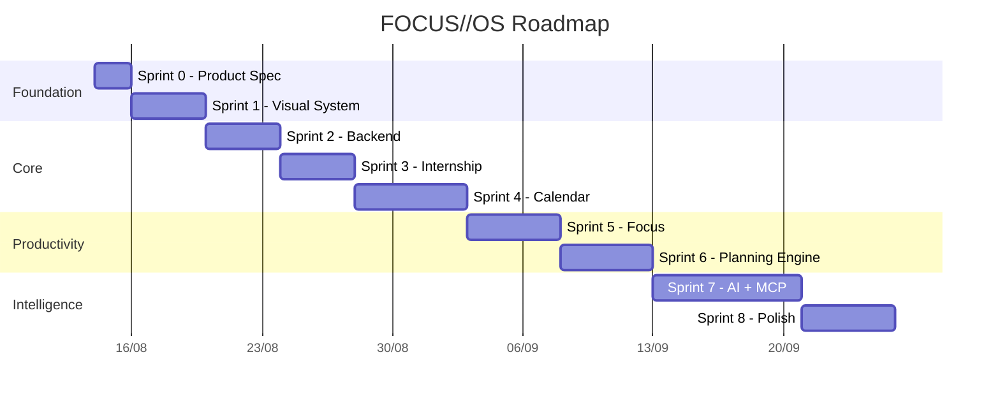

> Las fechas son ilustrativas. Lo importante es mantener el orden técnico.

---

# 72. Orden exacto recomendado

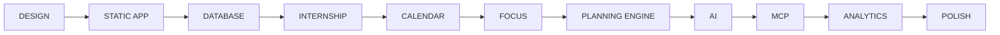

---

# 73. Qué NO hacer

Evitar este orden:

```text
AI
 ↓
MCP
 ↓
AI
 ↓
Google
 ↓
AI
 ↓
"¿por qué mi timer no funciona?"
```

Primero el producto.

Después la inteligencia.

---

# 74. Arquitectura de una acción

Ejemplo: iniciar pasantía.

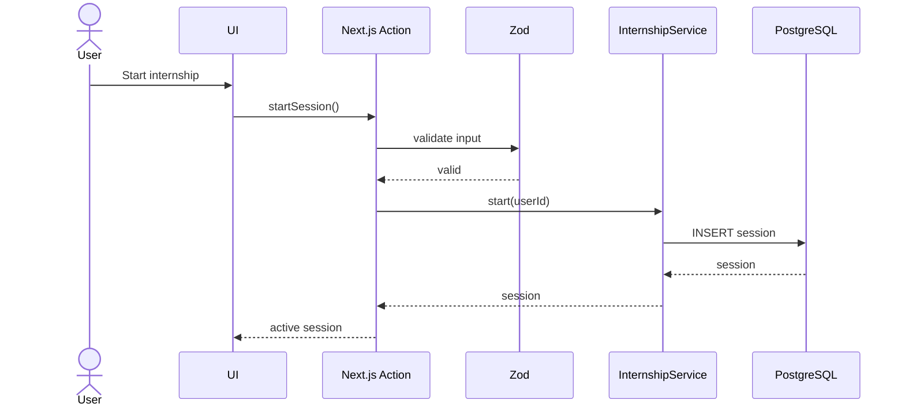

---

# 75. Arquitectura de una acción AI

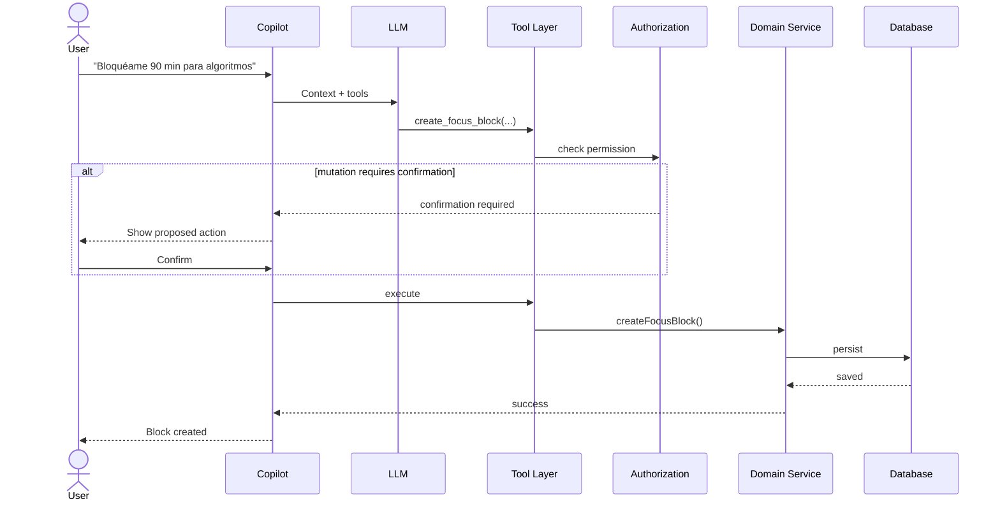

---

# 76. Riesgos técnicos

## 76.1 Overengineering

Riesgo:

```text
MCP
n8n
Trigger.dev
Supabase
AI SDK
Google
GitHub
PWA
```

todo antes del MVP.

Mitigación:

> añadir infraestructura solo cuando exista una necesidad concreta.

---

## 76.2 IA tomando decisiones incorrectas

Mitigación:

- lógica determinística;
- confirmación para mutaciones;
- logs;
- schemas;
- reglas de dominio;
- no SQL directo.

---

## 76.3 Sincronización de Calendar

Mitigación:

- normalizar eventos;
- guardar external IDs;
- sync token;
- webhooks;
- idempotencia;
- retry jobs.

---

## 76.4 Timer inconsistente

Mitigación:

- timestamp server-side;
- duration persistido;
- evitar depender del estado del navegador.

---

## 76.5 UI pesada

Mitigación:

- Server Components;
- lazy loading;
- Motion limitado;
- CSS para texturas;
- SVG ligero;
- code splitting.

---

# 77. Métricas del producto

No medir solo visitas.

Medir:

```text
Daily Open Rate
Focus Sessions / Week
Internship Hours Logged
Tasks Completed
Suggested Actions Accepted
Planning Accuracy
Estimated vs Actual Task Duration
Weekly Review Completion
```

---

# 78. Métrica principal

Una posible North Star:

> **Meaningful Focus Hours per Week**

Complementada por:

```text
% de sesiones completadas
% de tareas importantes terminadas
desviación estimación vs tiempo real
```

---

# 79. Estados visuales

## Focus

```text
idle
active
paused
completed
```

## Internship

```text
idle
active
manual_entry
completed
```

## Calendar sync

```text
connected
syncing
error
disconnected
```

## AI Action

```text
proposed
awaiting_confirmation
executing
completed
failed
```

---

# 80. Diseño de información

Evitar:

```text
Internship hours: 148
Progress: 61%
```

Preferir:

```text
● INTERNSHIP / ACTIVE

148H
────
240H REQUIRED

61.8

███████████████████░░░░░░░░░

+14H THIS WEEK
```

La percepción premium viene más de la jerarquía de información que de la decoración.

---

# 81. Filosofía de componentes

Cada elemento debe responder:

```text
¿Qué información comunica?
¿Qué acción permite?
¿Qué cambia cuando interactúo?
¿Necesita realmente animación?
```

Si no existe una respuesta clara, probablemente sobra.

---

# 82. Responsive

## Desktop

Optimizar para:

```text
1440px+
1280px
1024px
```

## Mobile

Optimizar para:

```text
390px
430px
```

Acciones primarias deben quedar accesibles con el pulgar.

---

# 83. Seguridad y privacidad

Principios:

```text
least privilege
RLS
server-side tokens
encrypted secrets
audit logs
explicit AI confirmations
no raw SQL from LLM
```

Tokens OAuth nunca deben exponerse innecesariamente al cliente.

---

# 84. Estrategia de permisos

Google:

```text
V1 → Calendar Read
V1.1 → Calendar Write si el usuario lo activa
V2 → Gmail/Tasks solo si aparece una funcionalidad que lo justifique
```

---

# 85. Estrategia MCP

## Fase 1

Sin MCP.

Construir funciones normales.

## Fase 2

Exponer funciones útiles como tools internas.

## Fase 3

Crear MCP propio.

## Fase 4

Permitir que otros clientes AI utilicen FOCUS//OS.

---

# 86. Evolución potencial

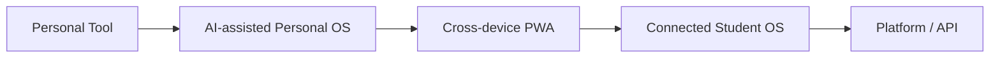

---

# 87. Posibles futuras integraciones

Cuando el core ya funcione:

```text
GitHub
Google Tasks
Gmail
LMS universitario
Drive
Slack
Notion
Trello
Todoist
Microsoft Outlook
```

Nunca integrarlas solo porque “se puede”.

---

# 88. Backlog futuro

## Productivity

- recurring focus blocks;
- deep work templates;
- study modes;
- exam countdown;
- deadline radar;
- semester overview.

## Internship

- export de reportes;
- firmas;
- observaciones;
- categorías de trabajo;
- historial mensual.

## AI

- planning assistant;
- weekly coach;
- deadline detection;
- overload detection;
- estimation calibration.

## Growth

- skill roadmaps;
- project tracking;
- GitHub link;
- learning goals.

---

# 89. Definición del MVP terminado

El MVP se considera terminado cuando:

```text
[ ] Login funciona.
[ ] Dashboard TODAY carga rápido.
[ ] Calendar se sincroniza.
[ ] Free slots funcionan.
[ ] Internship timer es persistente.
[ ] Horas restantes y pace funcionan.
[ ] Focus timer funciona.
[ ] Tareas tienen estimación.
[ ] Best Next Action funciona sin IA.
[ ] Mobile es usable.
[ ] No existen errores graves de sincronización.
```

---

# 90. Definition of Done por feature

Una feature no está terminada solo porque “funciona”.

Debe cumplir:

```text
✓ lógica correcta
✓ estados loading
✓ estados empty
✓ estados error
✓ responsive
✓ accesibilidad básica
✓ tipos correctos
✓ validación
✓ autorización
✓ tests esenciales
✓ visual consistente
✓ performance aceptable
```

---

# 91. Testing

## Unit tests

Para:

```text
calculateInternshipPace()
findFreeSlots()
rankTasks()
calculateWeeklyLoad()
estimateCompletionDate()
```

## Integration tests

Para:

```text
calendar sync
OAuth callback
start/stop sessions
task creation
AI confirmation flow
```

## E2E

Flujos:

```text
Login
Connect calendar
Start internship
Stop internship
Start focus
Create task
Accept AI suggestion
```

---

# 92. Observabilidad

Añadir desde temprano:

```text
structured logs
error tracking
job status
calendar sync logs
AI action logs
```

Nunca depurar sincronización de Google únicamente mirando `console.log`.

---

# 93. Estrategia de despliegue

```text
Frontend / Server → Vercel
Database / Auth   → Supabase
Background jobs   → Trigger.dev
External Calendar → Google Calendar
```

---

# 94. Variables de entorno

Ejemplo conceptual:

```text
NEXT_PUBLIC_SUPABASE_URL
NEXT_PUBLIC_SUPABASE_ANON_KEY
SUPABASE_SERVICE_ROLE_KEY

GOOGLE_CLIENT_ID
GOOGLE_CLIENT_SECRET

AI_PROVIDER_API_KEY

TRIGGER_SECRET_KEY
```

No subir `.env` al repositorio.

---

# 95. Repositorio

Estructura recomendada:

```text
focus-os/
│
├── src/
├── supabase/
├── public/
├── product/
├── docs/
├── tests/
├── scripts/
│
├── README.md
├── .env.example
├── package.json
└── tsconfig.json
```

---

# 96. Documentación mínima

```text
/product/requirements.md
/product/user-flows.md
/docs/architecture.md
/docs/database.md
/docs/google-calendar.md
/docs/mcp.md
/docs/design-system.md
/docs/deployment.md
```

---

# 97. Convención visual de estados

Ejemplo:

```text
● green   connected / active / success
● orange  attention / current action
● grey    idle / secondary
● red     error / overdue
```

No abusar de rojo.

---

# 98. Naming de módulos

Usar nombres de dominio:

```text
calendar
tasks
focus
internship
planning
growth
ai
```

Evitar carpetas ambiguas:

```text
utils2
helpers
stuff
misc
common-final
```

---

# 99. Domain Services

Ejemplo:

```text
CalendarService
TaskService
FocusService
InternshipService
PlanningService
AIActionService
```

La UI no debería contener reglas de negocio.

---

# 100. Principio final

FOCUS//OS no debería intentar responder:

> **“¿Cómo puedo almacenar toda mi vida?”**

Debe responder:

> **“¿Cuál es la siguiente acción correcta?”**

La experiencia ideal:

```text
YOU HAVE

2H 14M

before your next commitment.


BEST NEXT ACTION

Algorithms
90 min


[ START ]
```

Ese es el núcleo.

---

# 101. Resumen de decisión tecnológica

| Área | Tecnología |
|---|---|
| Framework | Next.js |
| Lenguaje | TypeScript |
| CSS | Tailwind CSS v4 |
| UI base | shadcn/ui |
| Animaciones | Motion |
| Validación | Zod |
| Base de datos | PostgreSQL |
| Backend platform | Supabase |
| Auth | Supabase Auth |
| Seguridad DB | RLS |
| Calendar | Google Calendar API |
| OAuth | Google OAuth 2.0 |
| Background jobs | Trigger.dev |
| IA | AI SDK + LLM provider |
| Agent tools | MCP |
| Automation prototype | n8n |
| Deploy | Vercel |
| Mobile | Responsive Web + PWA futura |

---

# 102. Stack final

```text
Frontend
│
├── Next.js
├── TypeScript
├── Tailwind CSS v4
├── shadcn/ui
├── Motion
└── Zod

Backend
│
├── Next.js Server Actions
├── Route Handlers
├── Domain Services
└── Trigger.dev

Data
│
├── Supabase
│   ├── PostgreSQL
│   ├── Auth
│   ├── RLS
│   └── Storage
│
└── Google Calendar API

AI
│
├── AI SDK
├── Tool Calling
├── MCP Client
└── Personal MCP Server

Prototype Automation
│
└── n8n

Deployment
│
├── Vercel
├── Supabase
└── Trigger.dev
```

---

# 103. Roadmap compacto

```text
SPRINT 0
Product Spec
    ↓
SPRINT 1
Design System
    ↓
SPRINT 2
Backend + Auth
    ↓
SPRINT 3
Internship
    ↓
SPRINT 4
Google Calendar
    ↓
SPRINT 5
Focus
    ↓
SPRINT 6
Planning Engine
    ↓
SPRINT 7
AI + MCP
    ↓
SPRINT 8
Polish + Performance
```

---

# 104. Objetivo de producto

El producto estará bien encaminado cuando abrirlo reduzca la fricción entre:

```text
“tengo cosas que hacer”
```

y:

```text
“sé exactamente qué hacer ahora”
```

---

# 105. Frase de producto

> **FOCUS//OS — Make the next block count.**

Alternativa:

> **FOCUS//OS — One system for what matters next.**

---

# 106. Resultado esperado

Al completar el roadmap, la plataforma debería:

- sincronizar clases y calendario;
- detectar tiempo libre;
- registrar pasantía;
- proyectar avance;
- controlar focus sessions;
- priorizar tareas;
- construir planes diarios;
- construir planes semanales;
- detectar sobrecarga;
- aprender desviaciones de estimación;
- mostrar insights;
- permitir interacción rápida;
- ofrecer un copiloto con herramientas;
- exigir confirmación para cambios sensibles;
- verse consistente y premium;
- funcionar correctamente en desktop y móvil;
- mantener buen rendimiento.

---

# 107. North Star

> **Una interfaz que reduzca decisiones durante el día y convierta tiempo disponible en progreso real.**

